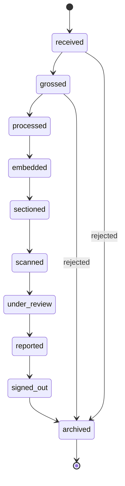

# Case Status State Machine

## States (for entity_type = 'specimen')

| # | State | Meaning |
|---|---|---|
| 1 | received | Specimen logged in at intake |
| 2 | grossed | Examined and described by lab tech |
| 3 | processed | Tissue chemically processed |
| 4 | embedded | Embedded in paraffin block |
| 5 | sectioned | Cut into slides via microtome |
| 6 | scanned | Slides digitized by scanner |
| 7 | under_review | Assigned to a pathologist |
| 8 | reported | Draft report written |
| 9 | signed_out | Report finalized and locked (terminal-ish) |
| 10 | archived | Final state |

## Allowed transitions

## Rules
- Only certain roles can perform certain transitions
  (e.g., only a pathologist can move from `reported` to `signed_out`)
- The current state lives in `entities.current_state_id`
- Every transition writes one row to `entity_status_history`
- `signed_out` is "soft terminal" — only `archived` follows it
- A `rejected` path exists from early states for bad specimens